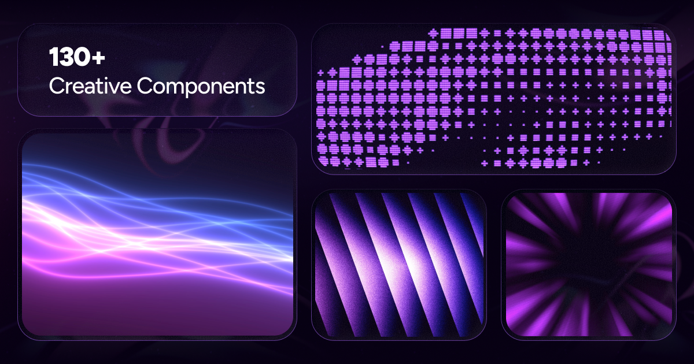
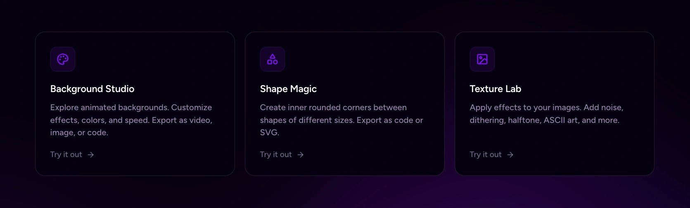

<div align="center">
	<br>
	<br>
  <h1>ArkDev Pro</h1>
	<br>
	<br>
  <strong>The largest & most creative library of animated React components.</strong>
  <br />
  <sub>Stand out with 130+ free, customizable animations for text, backgrounds, and UI.</sub>
	<br>
	<br>
  <a href="#"></a>
  <br>
  <br>
</div>

<br />

<div align="center">
  
</div>

<br />

## ✨ Why ArkDev Pro?

ArkDev Pro helps you **ship stunning interfaces faster**. Instead of spending hours crafting animations from scratch, grab a polished component and customize it to fit your vision.

> 💬 **Text Animations** · 🌀 **Animations** · 🧩 **Components** · 🖼️ **Backgrounds**

## 🚀 Features

- **130+ components** — text animations, UI elements, and backgrounds, growing weekly
- **Minimal dependencies** — lightweight and tree-shakeable
- **Fully customizable** — tweak everything via props or edit the source directly
- **4 variants per component** — JS-CSS, JS-TW, TS-CSS, TS-TW (everyone's happy)
- **Copy-paste ready** — works with any modern React project

## 🛠️ Creative Tools

<div align="center">
  
</div>

<hr />

### Beyond components, ArkDev Pro offers **free creative tools** to supercharge your workflow:

| Tool                 | What it does                                                                             |
| -------------------- | ---------------------------------------------------------------------------------------- |
| **[Background Studio](/tools)** | Explore animated backgrounds, customize effects, export as video/image/code              |
| **[Shape Magic](/tools)**       | Create inner rounded corners between shapes, export as SVG, React code or clip-path code |
| **[Texture Lab](/tools)**       | Apply 20+ effects (noise, dithering, ASCII) to images/videos and export in high quality  |

## 📦 Installation

ArkDev Pro supports [shadcn](https://ui.shadcn.com/) and [jsrepo](https://jsrepo.dev) for quick CLI installs.

```bash
# Example: Add a component via shadcn
npx shadcn@latest add @arkdev-pro/BlurText-TS-TW
```

Each component page includes copy-ready CLI commands. See the installation guide for full details.

You can also select your preferred technologies, and copy the code manually.

## 👤 Maintainer & Ownership

ArkDev Pro is an independent library owned and maintained exclusively by the **ArkDev Pro** team. All rights reserved.

## 📄 License

[MIT + Commons Clause](LICENSE.md) — free for personal and commercial use.

